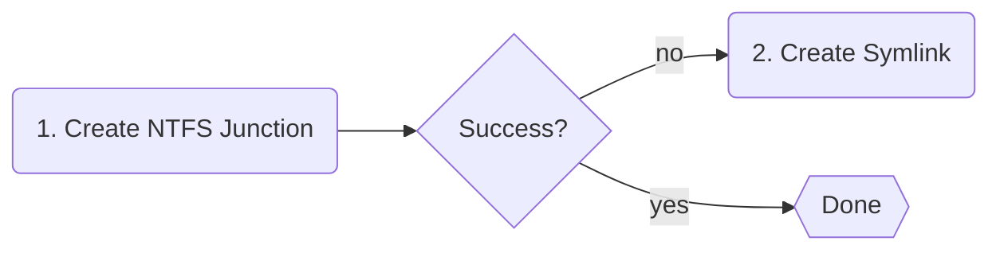

import SymlinkPermissionExplainer from '../_components/SymlinkPermissionExplainer.mdx';

# Operating Modes

NVM for Windows operates in one of two modes: link or shim. These modes determine how Node.js, dependency managers, and global modules are executed. The operating mode can be switched at any time.

```powershell title="Setting the Operational Mode"
# Easy access
nvm use shim
nvm use link

# Also available in the nvm configuration
nvm cfg set mode=shim
nvm cfg set mode=link
```

## Link Mode

This mode uses links to locate the active system-wide version of `node.exe`. The link path is part of the `PATH`. Running [`nvm use`](../command/use) changes the _target_ of the link path, not the path itself. `PATH` never changes.

Link mode offers the closest possible experience to running `node.exe` "as delivered" by [nodejs.org](https://nodejs.org). This mode offers zero latency. Link mode, by its nature, does not provide any advanced modern workflow features (shim mode does).

Version 2.0.0 introduced the "fallback" link creation strategy.



<SymlinkPermissionExplainer/>

:::warning
NVM for Windows v2 will not attempt to elevate permissions (i.e. no UAC prompt) on failure of symlink creation. If permissions block the creation of a link, a native desktop notification warns users and offers guidance.
:::

## Shim Mode (default)

Shim mode offers a streamlined developer experience. The tradeoff is additional latency (~25-35ms total).

Most users won't notice or feel the impact of shim latency, making shim mode recommended for most users.

Shim mode offers:

- Auto-use pinned versions via `.nvmrc`, `.node-version`, `package.json`, or other custom runtime config files.
- Auto-install missing versions on `nvm use`. (Optional)
- Unified package manager mismatch handling.
- Lockdown Node.js/V8 permissions. (Optional)
- Publisher trust: Verifies node.exe publisher to prevent untrusted node.exe swaps.
- Native event logging.
- Unified/configurable cooldown periods across all major package managers (npm/yarn/pnpm). _Requires the Governance add-on, available September 2026._

:::info
Windows has a "universal latency tax". It uses [`CreateProcessW`](https://learn.microsoft.com/en-us/windows/win32/api/processthreadsapi/nf-processthreadsapi-createprocessw) to launch _any_ executable. This tax is paid when the shim is launched and again when the shim runs `node.exe`. On average, `CreateProcessW` takes 15ms. The shim adds 1-3ms to identify the desired Node.js version and securely relay the command.

`15ms (shim CreateProcessW) + 3ms (shim logic) + 15ms (shim CreateProcessW) = 33ms`
:::

## Comparison

||Link|Shim|
|:-|:-:|:-:|
|Latency[^1]|0ms|25-35ms|
|System Version|:heavy_check_mark:|:heavy_check_mark:|
|Automatic Installtion|:heavy_check_mark:|:heavy_check_mark:|
|Automatic Version Detection|:x:|:heavy_check_mark:|
|Special Permissions<br/><br/>|[`SeCreateSymbolicLinkPrivilege`](https://learn.microsoft.com/en-us/previous-versions/windows/it-pro/windows-10/security/threat-protection/security-policy-settings/create-symbolic-links)<br/>_for [UNC path](https://learn.microsoft.com/en-us/dotnet/standard/io/file-path-formats#unc-paths) symlinks_|None<br/><br/>|


[^1]: Latency is predominantly from Windows `CreateProcessW` universal latency tax. The shim executable only adds ~1ms latency.
