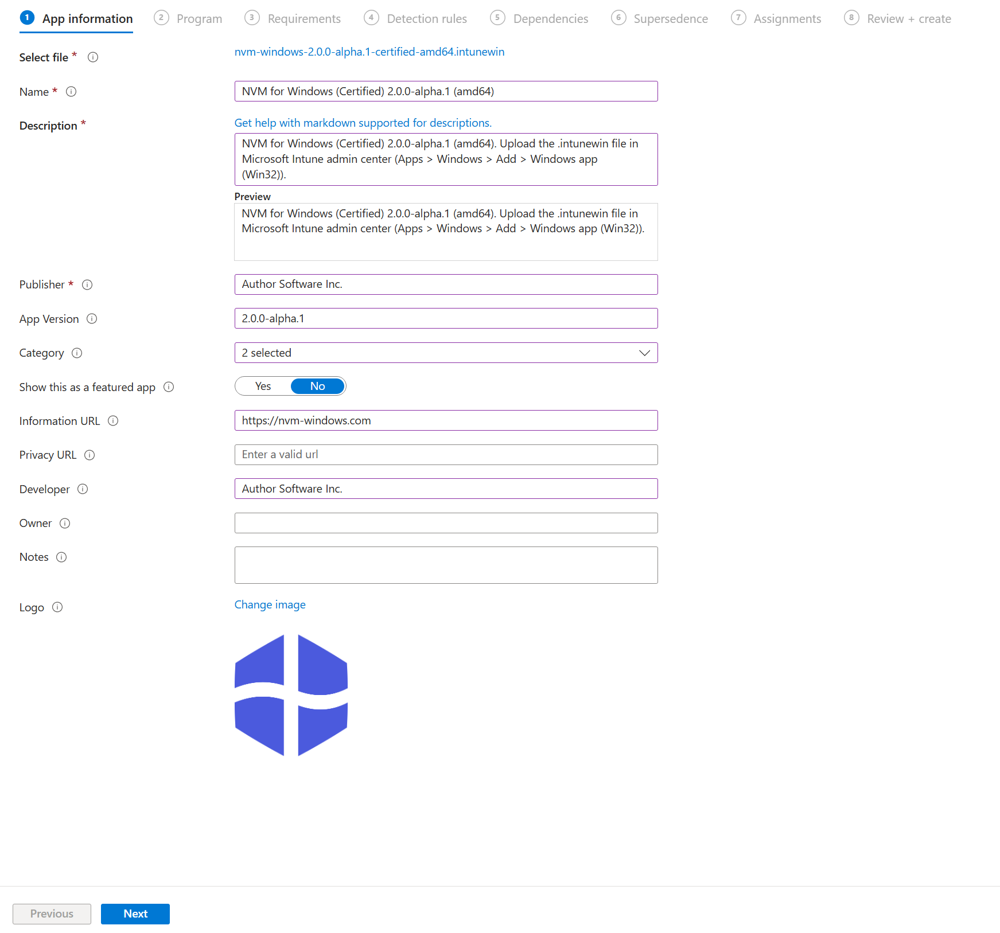
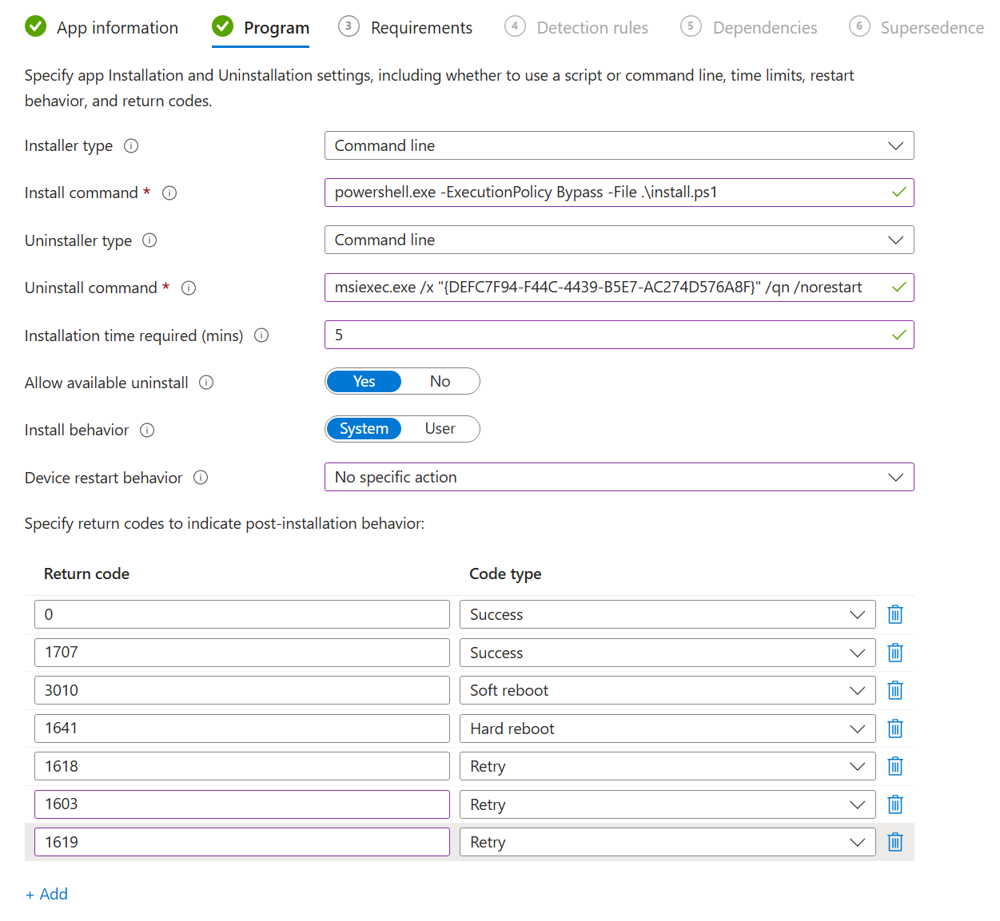
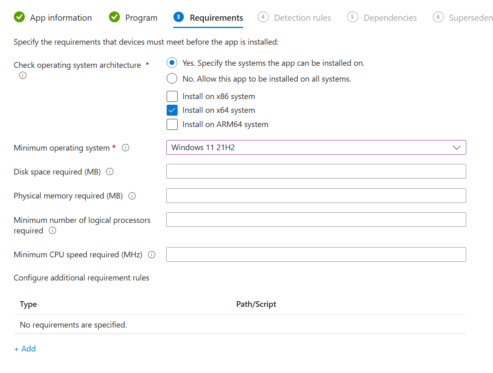
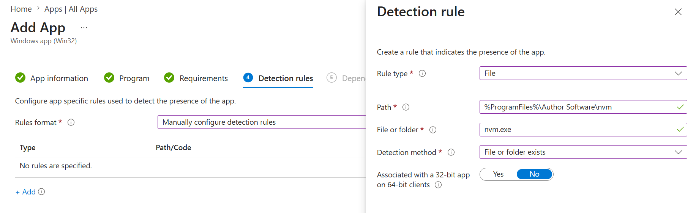

# Install

Phase 2 of [Enterprise Deployment](/guide/deploy/). Deploy NVM for Windows to managed devices using your platform below.

|Method|Minimum Tier|Use Case|
|:-|:-|:-|
|[Microsoft Intune](#using-intune)|Governance||
|[Active Directory GPO](#active-directory-gpo)|Governance||
|[Microsoft Endpoint Configuration Manager](#microsoft-endpoint-configuration-manager) (MECM)|Distro||
|[Google Workspace](#google-workspace)|Distro||
|[Manual](#manual-installation)|Distro||

## Using Intune

Deploy NVM for Windows with the pre-built Win32 package from your [customer portal](https://portal.author.io) deployment pack. No file server required. The installer runs as **System** and accepts the EULA automatically (`ACCEPT_EULA=1`).

|File|Purpose|
|:-|:-|
|`nvm-windows-<version>-certified-amd64.intunewin`|Upload to Intune as the Win32 app package|
|`nvm-windows-<version>-certified-amd64.intune.json`|Reference for install commands, detection rules, return codes, and MSI metadata|

Complete [Prerequisites](requirements) first. After installation, continue to [Configure policies](policy/).

### 1. Upload the app

In the [Microsoft Intune admin center](https://go.microsoft.com/fwlink/?linkid=2109431):

1. Go to **Apps** > **All apps** > **Create**.
1. Select **Windows app (Win32)**.
1. Select the app package file and upload `nvm-windows-<version>-certified-amd64.intunewin` from your deployment pack.
1. Wait for Intune to extract and validate the package.

### 2. App information

Use the values from the companion `.intune.json` file:

|Field|Value|
|:-|:-|
|Name|`NVM for Windows (Certified)`|
|Publisher|`Author Software Inc.`|
|Version|`<version>`|
|Description|Certified build for amd64. See `.intune.json` for the exact string shipped with your package.|

### 3. Program settings

|Setting|Value|
|:-|:-|
|Install command|`powershell.exe -ExecutionPolicy Bypass -File .\install.ps1`|
|Uninstall command|`msiexec.exe /x "{DEFC7F94-F44C-4439-B5E7-AC274D576A8F}" /qn /norestart`|
|Install behavior|**System**|
|Device restart behavior|**No specific action** (suppress)|

:::info[Product code]
The uninstall command product code (`{DEFC7F94-F44C-4439-B5E7-AC274D576A8F}`) and other MSI metadata are listed under `msiInformation` in your `.intune.json`. Use the values from the manifest that ships with your build if they differ.
:::

Add the return codes from `.intune.json`:

|Code|Type|
|:-|:-|
|`0`|Success|
|`1707`|Success|
|`3010`|Soft reboot|
|`1603`|Retry|
|`1618`|Retry|
|`1619`|Retry|

### 4. Requirements

|Setting|Recommendation|
|:-|:-|
|Operating system architecture|**x64** or **ARM64**|
|Minimum OS|Windows 11 21H2|

:::info
Only select x64 **or** ARM64 for the operating system architecture. If you need both options, create separate Intune applications for each architecture. There is a dedicated `.intunewin` installer for each architecture.
:::

### 5. Detection rules

Add a **File** detection rule:

|Setting|Value|
|:-|:-|
|Path|`%ProgramFiles%\Author Software\nvm`|
|File or folder|`nvm.exe`|
|Detection method|**File or folder exists**|
|Associated with a 32-bit app on 64-bit clients|**No**|

### 6. Dependencies

Unnecessary (skip).

### 7. Supercedence

Unnecessary (skip) when deploying the first time. See [Operate & Maintain](./operations) for supercedence guidance when deploying an update.

:::warning[Upgrading from NVM for Windows v1]
If your organization used NVM for Windows v1.1.7+, v2 will auto-migrate. Versions below 1.1.7 should be uninstalled, but users will lose their existing installations and settings.

If you created a custom Intune application from v1.1.7+, it needs to be superceded. See the maintenance guide for details.
:::

### 8. Assignments

1. Complete the wizard and **Assign** the app to device or user groups.
1. Confirm deployment status under **Apps** > **Monitor** > **App install status**.
1. Install logs are written to `%ProgramData%\Author\nvm-certified-install.log` on the target device.

## Microsoft Endpoint Configuration Manager

## Active Directory GPO

**What you'll need:**

- The NVM for Windows MSI installer and MST patch[^1] (available in the [customer portal](https://portal.author.io)).
- Administrative access to your domain controller to create group policies.

### Prepare the file server

GPO software installation reads the MSI and MST from a network share. Domain Computers must be able to reach that share when the policy applies.

Upload the NVM for Windows MSI and MST files from your deployment package to a file server accessible to **Domain Computers** and any users in the GPO scope. Grant read access to those principals.

### 1. Open the Group Policy Management Console

- **Using Run Command**: Press Windows Key + R, type `gpmc.msc`, and hit OK.
- **Using Start Menu**: Click Start, type Group Policy Management, and select the top application result.
- **Using Server Manager**: Open the Microsoft Server Manager Console, click Tools in the upper right-hand corner, and click Group Policy Management.

### 2. Create Group Policy

1. Right-click on the organizational unit containing the computer(s) where NVM for Windows will be installed. Select "Create a GPO in this domain, and link it here.".
1. Click on the GPO. In the right-hand pane, select the "Scope" tab.
1. Under "Security Filtering", click "Add". In the "Enter object name to select" section, add `Domain Computers`. If you have any security groups you wish to limit the installation to, add them as well. Click "Check Names" to assure they are all recognized. Click OK to proceeed.
1. If "Authenticated Users" is present under "Security Filtering", remove it.
1. Click the "Delegation" tab. Assure `Domain Computers` and any groups you specified are in the list.

### 3. Configure Group Policy Installation Package

1. Right-click the GPO and select "Edit".
1. Navigate to **Computer Configuration** > **Policies** > **Software Settings** > **Software installation**. Make sure to select the _Computer Configuration_ and not the user configuration. Unlike the public edition, NVM for Windows certified builds are installed at the machine level[^2].

3. Right-click "Software installation", then select "New > Package". This will open a file selection dialog.
1. Navigate to the location on your file server where the NVM for Windows installation media was uploaded. Select the `.msi` file and press "Open". This will present a "Deploy Software" dialog.
1. Select `Advanced` on the "Deploy Software" dialog, then "OK".
1. Click on the "Deployment" tab and choose "Assigned" as the deployment type. Check "Uninstall this application when it falls out of the scope of management" if you wish to remove NVM for Windows when it no longer applies to users.

:::warning[Automatic Uninstallation via GPO Consequences]
Automatically uninstalling NVM for Windows when the application falls out of the scope of management may have an unintended critical impact on users erroneously removed from the installation scope.

Uninstalling NVM for Windows removes all Node.js versions managed by NVM for Windows. This includes any global modules users have installed in these Node.js versions. It is possible to backup the Node.js storage directory before removing. This folder can be manually restored if NVM for Windows needs to be reinstalled later.

Default storage directory: `%LOCALAPPDATA%\Author Software\nvm\installs`
:::

7. Click the "Modifications" tab, then click the "Add" button.
1. Navigate to the file server and select the `.mst` file[^1]. By doing this, you're agreeing to the EULA on behalf of any user the application is installed for (required).
1. Press "OK" to close the window.
1. In the GPO manager, navigate to **Computer Configuration** > **Policies** > **Administrative Templates** > **System** > **Group Policy**.

11. Double-click to open the policy, choose "Enabled", and choose **Merge** or **Replace**.
1. Click "OK".

**Congratulations, you've created a group policy that will install NVM for Windows on user computers.**

:::tip[Update Client Device]
Run `gpupdate /force` in a terminal on the client device to immediately apply the policy.
:::

:::tip[Alternative User Configuration with Elevated Privileges]
It is also possible to create the installer under the user configuration by elevating user privileges for the installation.

This method moves the deployment to User Configuration so it triggers at logon, but configures Active Directory to temporarily bypass user restriction rules to execute the MSI with administrative authority.

1. **Create or Edit a GPO**: Link it to the OU containing your target Users.
1. **Configure Software Installation**: Add your MSI under User *Configuration* > *Policies* > *Software Settings* > *Software Installation*. Select *Advanced*, and you will now be able to check *Install this application at logon*.
1. **Elevate Installer Privileges:**
  1. Navigate to *Computer Configuration* > *Policies* > *Administrative Templates* > *Windows Components* > *Windows Installer*.
  1. Double-click **Always install with elevated privileges**.
  1. Set it to **Enabled**, click Apply, and click OK.
  1. Navigate to *User Configuration* > *Policies* > *Administrative Templates* > *Windows Components* > *Windows Installer*.
  1. Double-click **Always install with elevated privileges** there as well and set it to **Enabled**.

  :::warning Temporary Security Risk
  *Enabling "Always install with elevated privileges" allows standard users to run any Windows Installer package with elevated privileges, which can be exploited by malicious actors.*
:::

## Google Workspace

## Manual Installation

[^1]: The MST patch must be applied to automatically accept the EULA.
[^2]: If you are upgrading your fleet of computers from public builds to certified builds, the certified build MSI installer will automatically migrate existing Node.js installations and user preferences.
