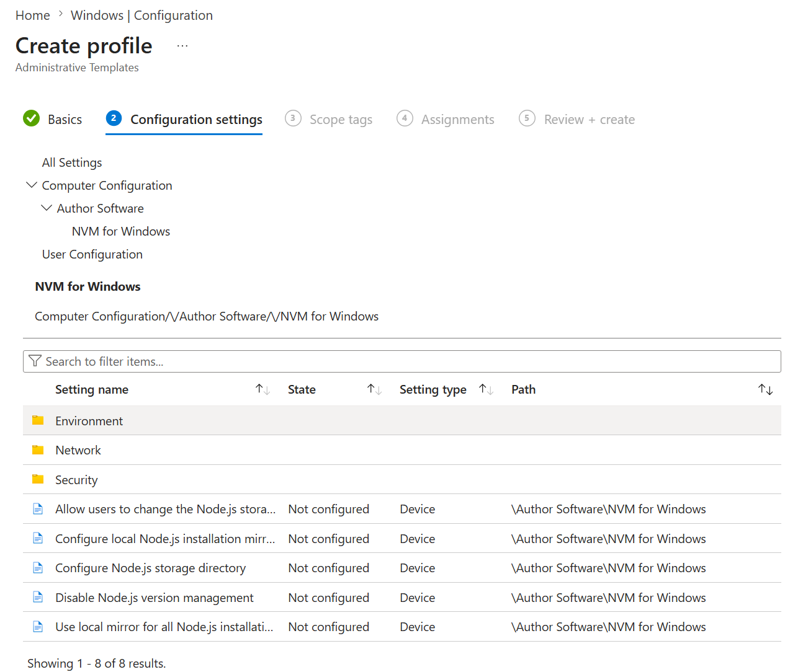

# Administrative Templates (Intune & GPO)

NVM for Windows enforces standards and security policies through ADMX/ADML administrative templates. Use them in **on-premises Group Policy** or **Microsoft Intune** configuration profiles.

|Resource|Guidance|
|:-|:-|
|ADMX file| Controls the technical registry settings. Available at [portal.author.io](https://portal.author.io).|
|ADML file| Provides the language text for the settings. Available at [portal.author.io](https://portal.author.io).|
|Target path| `HKLM\Software\Policies\Author Software\nvm`|

Download the ADMX/ADML from the [customer portal](https://portal.author.io). For Win32 app installation through Intune, see [Install → Intune](../install#using-intune).

---

## Intune policy configuration

After NVM for Windows is [installed](../install#using-intune), enforce settings with the administrative template.

### 1. Import ADMX and ADML

1. In [Intune admin center](https://go.microsoft.com/fwlink/?linkid=2109431), go to **Devices** > **Windows** > **Configuration**.
1. Open **Administrative templates** (or **Import ADMX** if prompted before first use).
1. Import `NVMWindows.admx` and `en-US\NVMWindows.adml` from your deployment pack. No `Windows.admx` prerequisite is required.

If deployment fails with error **131329** (0x20101):

1. On the device, run `certified\enhanced\policy\Get-NvmAdmxIngestDiagnostics.ps1` and note the **HRESULT** on `ADMX Ingestion` events (for example `0x8007000D` invalid ADMX data, `0x80070005` blocked registry path).
1. Delete the prior NVM ADMX import in Intune, then re-import the updated template.
1. Clear stale ingest state on the device, then sync again:

```powershell
Remove-Item -Recurse -Force "$env:ProgramData\Microsoft\PolicyManager\ADMXIngestion\*nvm*" -ErrorAction SilentlyContinue
Get-ChildItem 'HKLM:\SOFTWARE\Microsoft\PolicyManager\AdmxInstalled' -Recurse |
  Where-Object { $_.Name -match 'nvm' } |
  Remove-Item -Recurse -Force
```

Until ADMX ingest succeeds, deploy values with Registry CSP OMA-URIs from `NVMWindows-google-workspace.csv` (see tip below).


### 2. Create a configuration profile

1. Go to **Devices** > **Configuration** > **Create** > **New policy**.
1. Platform: **Windows 11 and later** (includes Windows Server 2019 and later).
1. Profile type: **Administrative Templates**.
1. Navigate to **Author Software** > **NVM for Windows** and configure policies.



Policy names match the GPO tree below. Registry value names are in the [Central Registry Reference](registry).

:::tip[Registry CSP alternative]
You can also deploy individual registry values with a **Settings catalog** or **Custom configuration** profile using the OMA-URI paths in `NVMWindows-google-workspace.csv` from the policy bundle. See [Google Workspace](google-workspace) for the same Registry CSP pattern used on managed Windows devices.
:::

---

## Group Policy (GPO) deployment

:::info[Domain Controller Access]
You will need access to your domain controller to perform the tasks in this section.
:::

_On your domain controller:_

1. Copy `NVMWindows.admx` to `\\domain\sysvol\domain\Policies\PolicyDefinitions`.
1. Copy `en-US\NVMWindows.adml` to `\\domain\sysvol\domain\Policies\PolicyDefinitions\en-US`.
1. Open the Group Policy Management Editor (`Windows Key + R`, type `gpedist.msc` and press **Enter**.)
1. Locate the Group Policy Object (or create a new one) used to manage Node.js policies. Right click and select **Edit**.
1. Navigate to **Computer Configuration** > **Policies** > **Administrative Templates** > **Author Software** > *NVM for Windows*.


Policy names below match the **Administrative Templates** tree in Group Policy Management Editor and Intune after ADMX import.

```powershell
Computer Configuration
└── Policies
    └── Administrative Templates
        └── Author Software
            └── NVM for Windows
                ├── Disable Node.js version management
                ├── Configure Node.js storage directory
                ├── Allow users to change the Node.js storage directory
                ├── Configure local Node.js installation mirror source directory
                ├── Use local mirror for all Node.js installations
                ├── Network
                │   ├── Configure proxy server address
                │   ├── Configure proxy authentication type
                │   ├── Configure proxy authentication value
                │   ├── Configure Node.js download mirror(s)
                │   ├── Configure npm registry mirror(s)
                │   ├── Always cache downloads
                │   ├── Disable removal of cached downloads
                │   ├── Disable NVM for Windows upgrades
                │   └── Disable project and release announcements
                ├── Environment
                │   ├── Set operating mode
                │   ├── Configure custom version aliases
                │   ├── Configure automatic version detection files (e.g. .nvmrc)
                │   ├── Configure default auto-detect file
                │   ├── Disable automatic version detection
                │   ├── Disable automatic version installation
                │   ├── Always prompt before automatic installation
                │   ├── Configure auto-installed global npm modules
                │   ├── Disable native tool installation
                │   └── Configure package manager mismatch action
                └── Security
                    ├── Enable audit logging
                    ├── Configure allowed Node.js versions
                    ├── Configure blocked Node.js versions
                    ├── Disable insecure downloads
                    ├── Configure approved vendors (trusted code signers)
                    └── Configure npm package minimum release age
```

:::tip[Language Support]
Contact support@author.io to request a language other than English.
:::
