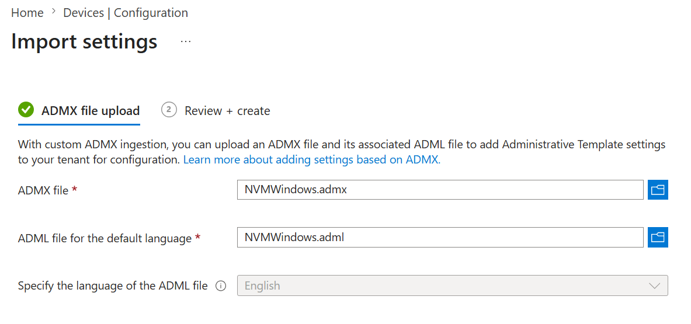

# Configure Policies

Phase 3: enforce NVM for Windows settings after the application is [installed](../install).

Common policy goals:

- Corporate proxies (IWA/PAC/WPAD on Governance; basic/bearer on all certified editions) for Node.js downloads
- Block unapproved or EOL Node.js versions
- npm/yarn/pnpm package cooldown periods
- Shim-only controls (audit logging, auto-detect, code signer trust)
- Air-gapped installs via local mirrors

## By platform

|Platform|Guide|
|:-|:-|
|Microsoft Intune / Entra|[Administrative Templates](administrative-templates#intune-policy-configuration)|
|Active Directory GPO|[Administrative Templates](administrative-templates#group-policy-gpo-deployment)|
|Microsoft Endpoint Configuration Manager|[MECM](mecm)|
|Google Workspace|[Google Workspace](google-workspace)|

## Reference

|Resource|Guide|
|:-|:-|
|All registry keys and values|[Central Registry Reference](registry)|
|ADMX policy tree (GPO and Intune)|[Administrative Templates](administrative-templates)|

Policy values deploy to `HKLM\Software\Policies\Author Software\nvm` unless noted in the registry reference.
