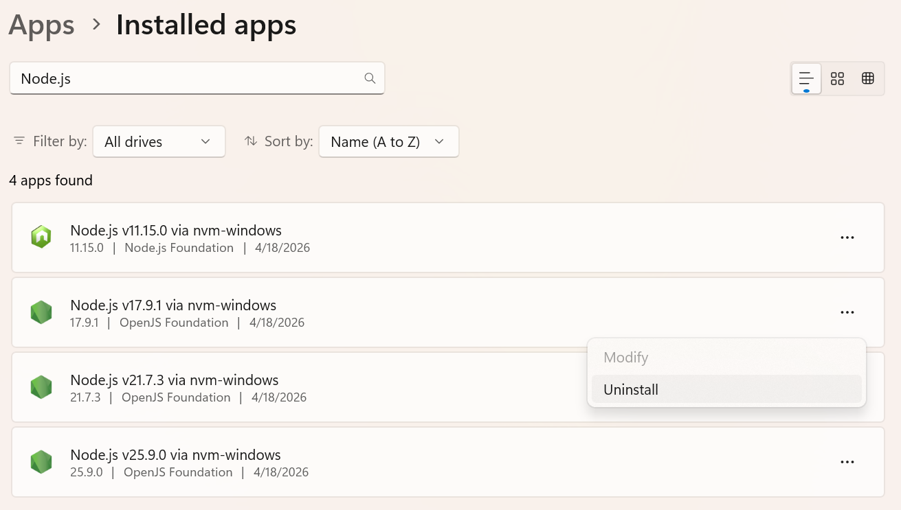
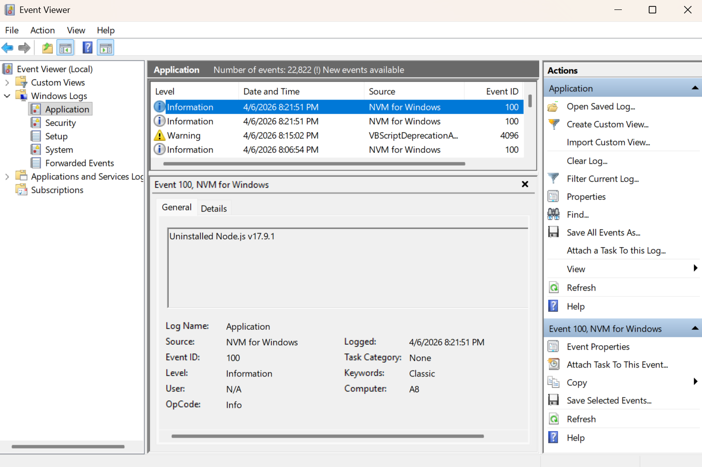

NVM for Windows runs natively in Microsoft Windows. Several integrations help the application integrate into the broader Microsoft ecosystem while remaining familiar and friendly for Node.js developers.

## Windows Apps

Installed versions of Node.js are visible in the Windows Apps screen. It is possible to uninstall directly from this screen.

## Windows Event Center

Critical events, such as installations, configuration changes, and security events are logged natively. This allows for clear organization observability and auditing using tools most companies already implement.

The application currently only logs critical change events, but we've considered adding finer control over logging in certified builds. For example, it is possible to log every node.exe/npm/npx invocation in strongly audited environments. The choice was made to not include this to prevent noisy logs, but it is possible.

:::warning
The community installer prompts the user to elevate permissions for the specific task of registering NVM for Windows as a system event source. **Do not run the installer as an administrator!** Running as administrator will configure all settings for the "administrator" account instead of your user account.

**The certified build installer supports deploying NVM for Windows without this concern.**

If it is not possible to elevate permissions during installation, event logging will still work, but Windows will show an "unknown" source instead of "NVM for Windows". It will also fallback to more generic event codes.
:::

## Windows Notification Center

NVM for Windows leverages native desktop notifications through the notification center. Missed notifications will be available in the notification center until acknowledged.

Since all notifications leverage the notification center, personal notification preferences are honored.

## Windows Registry

As of v2.0.0, settings and preferences are stored in the registry under user keys. These can be modified with the [`nvm config`](../command/config) command.

Prior versions of NVM for Windows utilized a plain text file for settings. Some users experienced difficulties with special characters due to encoding types enforced by older versions of Go. By leveraging the registry instead, Windows handles encoding natively, by the native locale.

:::tip Enterprise Security
NVM for Windows provides significant capabilities for developers. In highly regulated environments, some of these capabilities may need to be throttled or disabled for compliance.

**Certified builds** provide an option to override settings, enabling organizations to secure desktop environments according to their own policies.
:::