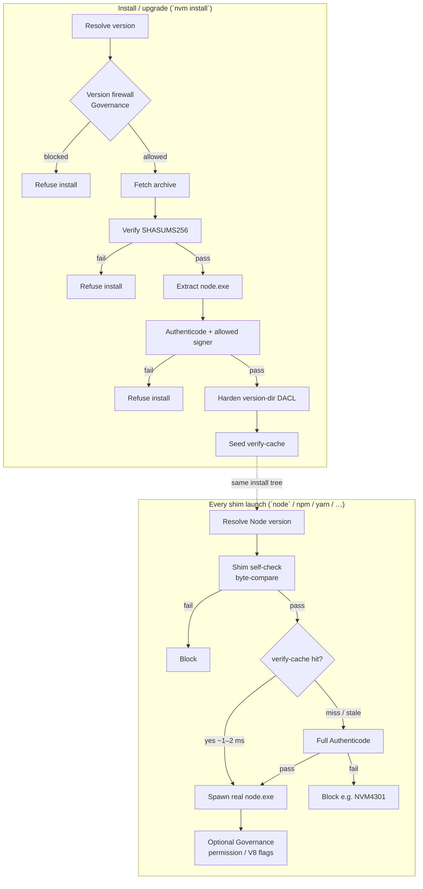
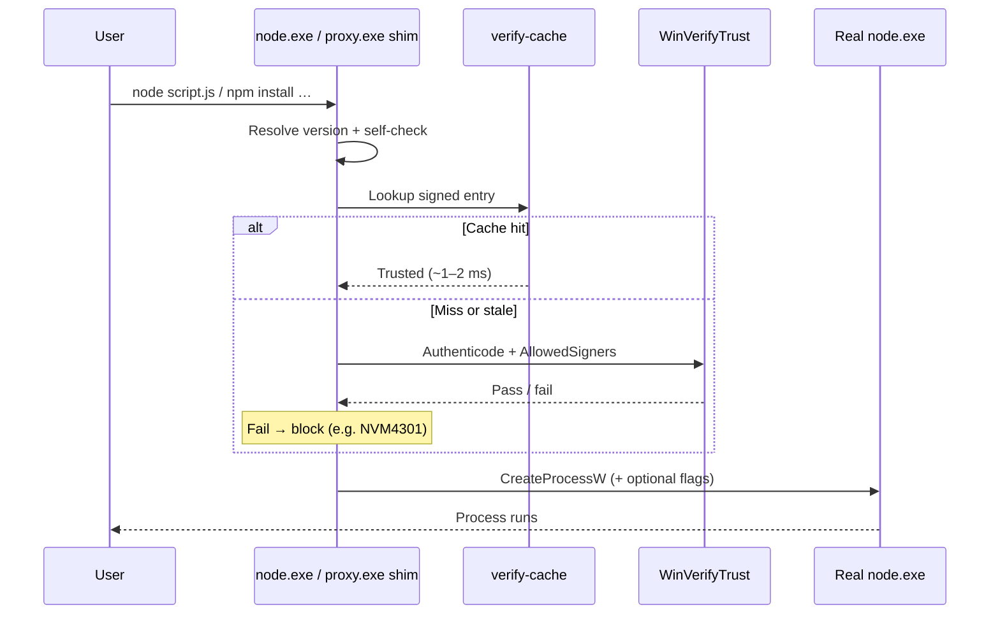

# Understanding Security

Version managers historically bypassed permissions, installed executable files wherever they want, and automated processes opaquely. These are exploitable attack surfaces, yet the fluidity afforded by these open operations provides a simple workflow developers love. Developers don't inherently wish to be insecure, but the nuances of managing Node.js securely often impact productivity to unacceptable levels. Developers are faced with a difficult choice to be secure _or_ be productive.

NVM for Windows was designed to provide security _and_ productivity. It aims to retain / expand the modern workflow developers crave while working within the protective boundaries of the OS instead of around them.

This guide summarizes how this is achieved, explains **what is checked**, **when**, and **which edition** owns which control.

## Downloading Node.js

NVM for Windows v2 treats Node.js as an untrusted download until it passes integrity checks. Once these checks complete successfully, the version becomes available for use.

NVM for Windows also provides several mechanisms to prevent unapproved version installations, such as blocking end-of-life or unpatched versions.

### Local Version Firewall

NVM for Windows can be configured to honor version allow/block-lists. These may contain specific versions or ranges. Version downloads (including cached/local) can be blocked with the firewall.

:star: [Learn more about the version firewall](/features/author-mirror#firewall)

### Node.js Gateway / Mirror

Author Software provides a hosted Node.js download mirror. It contains a customizable gateway to restrict downloads by version, version maintainability (EOL), user, domain, and other optional criteria.

The mirror can be used in combination with proxies to force Node.js downloads through this gateway, providing organizations the ability to allow Node.js downloads in accordance to their own policies.

:star: [Learn more about the gateway / mirror](/features/author-mirror#author-mirror)

## Installing Node.js versions

NVM for Windows installs Node.js versions to the configured storage location. It also manages the directory and file permissions automatically. For example, directory write permissions are restricted, preventing `node.exe` and global node modules from being overwritten by an unapproved file masquerading as an official executable.

Additionally, each Node.js version is registered with the operating system (see [Windows Apps: Added Cybersecurity Value](/features/windows-apps)). This provides scanners a baseline of which versions are intentionally installed (approved), making it much simpler to identify  unapproved `node.exe` files that may be present on a compromised  computer.

## Using the `node` command

## Using package managers

## Using global modules

## Enforcing policies in a team / organization

## Auditing & Observability

SIEM, registered app (intentionality), notifications as telemetry

## Security model at a glance

In [**shim mode**](/features/modes#shim-mode), NVM for Windows verifies the binary on every launch. Certified and Governance editions add machine policy, version firewalls, and (optionally) an Author-hosted download mirror/gateway.

:::important
[Link mode](/features/modes#link-mode) does not provide additional security verifications.
:::

## Security model at a glance

**Edition keys**

| Control | Community | Certified | Governance add-on |
|:-|:-:|:-:|:-:|
| Archive SHASUM + `node.exe` Authenticode | ✓ | ✓ | ✓ |
| Allowed publisher org / thumbprint pins | ✓ | ✓ | ✓ |
| Version-directory DACL hardening | ✓ | ✓ | ✓ |
| Shim verify-cache + per-launch trust | shim mode | shim mode | shim mode |
| HKLM policy override (ADMX) | — | ✓ | ✓ (+ full ADMX pack) |
| Version allow/block firewall | — | — | ✓ |
| Package-manager cooldown | — | — | ✓ |
| Force `--permission` / V8 lockdown | — | — | ✓ |
| Author mirror + hosted rules | — | — | ✓ |

Shim-mode security features do not apply in [link mode](../features/modes#link-mode). Prefer shim mode for managed fleets.

## 1. Install-time verification

When `nvm install` (or auto-install) fetches a Node.js build:

1. **Version firewall** (Governance) — `VersionAllowList` / `VersionBlockList` can refuse the version before download. See [Version Firewall + Author Mirror](../features/author-mirror).
1. **Archive integrity** — the `.7z` (or staged archive) is checked against the published `SHASUMS256` file for that version/arch.
1. **Authenticode on `node.exe`** — after extract, Windows trust verification runs on the binary. A valid signature alone is not enough: the signer organization must be on the allow list.
1. **Default trusted organizations** — `OpenJS Foundation`, `Node.js Foundation`, and `Author Software Inc.` are always trusted. Add others (for example **NodeSource**) with [`AllowedSigners`](../cfg/registry#available-registry-keys). Optional [`AllowedThumbprints`](../cfg/registry#available-registry-keys) pin specific certificate leafs.
1. **DACL hardening** — the version install directory is locked so **other user accounts** cannot rewrite `node.exe` (or swap a trojan into that tree). A compromised account that already owns the profile can still attack its own files; the control targets cross-account and remote write abuse.
1. **Verify-cache seed** — a signed cache entry is written so later shim launches can skip full Authenticode on the hot path.

Revocation behavior is configurable (`AuthenticodeRevocation`; air-gapped installs prefer cached checks). See [Registry Policy Reference](../cfg/registry).

## 2. Runtime verification (shims)

v2’s primary runtime shims are:

| Binary | Role |
|:-|:-|
| `.shim\node.exe` | Resolves version, verifies trust, applies optional security flags, spawns real Node |
| `utils\proxy.exe` | Same trust path for npm / npx / yarn / pnpm and [global module](../command/global-module-shims) CLIs |

(`reshim.exe` is a helper, not a day-to-day command shim.)

On every launch the shim:

1. Resolves which Node.js version to run ([version resolution](./version-resolution)).
1. **Self-checks** when invoked from the data-root `.shim` tree — byte-compares against the canonical Program Files / install payload (integrity of the shim itself, not a second Authenticode round-trip).
1. **Trusts `node.exe`** — prefer a verify-cache hit (~1–2 ms). On miss or cache invalidation, run full Authenticode against allowed signers. Failure blocks execution (for example **NVM4301**).
1. Optionally prepends Governance security flags (below), then `CreateProcessW` the real Node.js.

Details: [node (shim)](../command/node), [Package Manager Shims](../command/package-manager-shims).

## 3. Package managers and modules

Through `proxy.exe`, NVM can apply **Governance** package-manager controls such as [`NpmModuleMinimumAge`](../cfg/registry#governance-keys) (cooldown / minimum publish age for npm, pnpm, and yarn).

Certified Builds also enforce the **[NVM Firewall](firewall)** module allow lists (`ApprovedModules` / `ApprovedGlobalModules`) on shimmed installs, and both editions support the **trust firewall** (`TrustedModules`) so approved self-updating global CLIs can auto-reshim after they rewrite their entrypoints.

Supply-chain risk inside transitive `node_modules` remains largely an upstream registry problem; Author Software’s longer-term Runtime / advanced security work addresses deeper checks separately. What NVM gates today:

- **Node.js versions** — local firewall + optional Author mirror rules ([author-mirror](../features/author-mirror))
- **Publisher trust** on `node.exe` every launch
- **Cooldown** on package-manager installs (Governance)
- **Package allow lists** (Certified module firewall) and **self-update trust** (trust firewall) — see [Firewall](firewall)

## 4. Node permission and V8 lockdown (Governance, shim mode)

Most teams never pass Node’s permission model flags. Governance policy can force them on every shimmed launch:

| Policy | Effect |
|:-|:-|
| `EnforcePermissionModel` | Prepend `--permission` (Node 23+) or `--experimental-permission` (20–22). Default-deny FS/network until the process passes `--allow-*`. NVM does not inject grants. |
| `FreezeV8GlobalObjects` | Prepend `--frozen-intrinsics` |
| `DisableEvalAndStringExecution` | Prepend `--disallow-code-generation-from-strings` (blocks `eval` / `new Function`; does not cover `node:vm`) |

See [Operating Modes](../features/modes) and [registry keys](../cfg/registry#available-registry-keys).

## 5. Registry and enterprise policy

Settings live in the Windows registry. Broadly:

- **User preferences (HKCU)** — what an interactive user can change without admin rights.
- **Machine preferences / Policies (HKLM)** — what administrators and MDM/GPO write. Certified builds honor **machine policy** so admins can override user choices for security-sensitive keys.

The **Governance** pack ships **ADMX/ADML** templates for Active Directory and Entra/Intune-style configuration. Different GPOs can set different risk postures (for example block EOL Node for most users, allow one legacy version for a migration team). See [Administrative Templates](../cfg/ad) and [Registry Policy Reference](../cfg/registry).

## 6. Author download mirror (Governance)

Organizations can deny public `nodejs.org/dist` at the network edge and allow-list `mirror.author.io`. NVM then downloads through Author’s policy-aware mirror. Controls combine:

- Client/GPO lists (`VersionAllowList` / `VersionBlockList`, including lifecycle aliases such as `EOL`)
- **Hosted rules** in the [customer portal](https://portal.author.io) (IP, geo, domain/tenant, SID, license group)

Walkthrough: [Version Firewall + Author Mirror](../features/author-mirror). Domain/tenant IDs: [Find Your AD Domain or Entra Tenant ID](./find-domain-tenant-id).

## 7. Auditing and native integrations

Critical install, config, and security events go to Windows Event Viewer on Community and Certified builds. Optional **Advanced Logging** (Certified add-on) targets SIEM-friendly structured codes. Per-invocation logging is available via [`LogExecutions`](../cfg/registry#available-registry-keys) in shim mode.

See [Event Logging](../features/log). Broader product context (including native integrations): [Why we rewrote NVM for Windows](https://medium.com/@goldglovecb/why-we-rewrote-nvm-for-windows-3b6fa5be3e7f) (external).

## Related

| Topic | Doc |
|:-|:-|
| Shim behavior | [node (shim)](../command/node) |
| npm / yarn / pnpm shims | [Package Manager Shims](../command/package-manager-shims) |
| Shim vs link | [Operating Modes](../features/modes) |
| Policy keys | [Registry Policy Reference](../cfg/registry) |
| Version firewall / mirror | [Author Mirror](../features/author-mirror) |
| Editions | [Choosing an Edition](./builds/) |
| Error codes (NVM43xx / NVM44xx) | [Error Codes](../troubleshooting/error-codes) |
