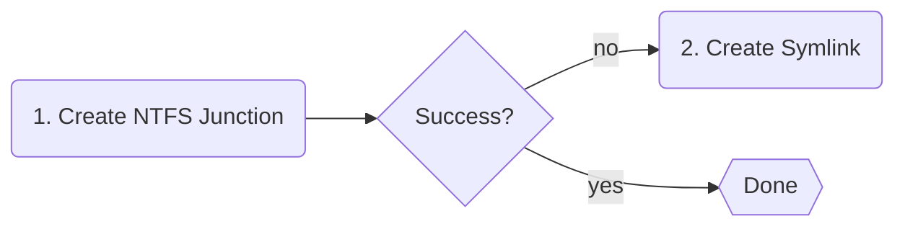

# Operating Modes

NVM for Windows operates in one of two modes: link or shim. The mode determines how the active Node.js version is made available to the system. The current mode can be toggled at any time.

```powershell title="Setting the Operational Mode"
# Easy access
nvm use shim
nvm use link

# Via nvm configuration
nvm cfg set mode=shim
nvm cfg set mode=link
```

## Link Mode

Link Mode uses links to locate the active system-wide version of `node.exe`. The `.nodejs` target is updated any time the default version is changed via [`nvm use`](../command/use).

Link mode offers an experience that is as close as possible to simply running `node.exe` "as delivered" by [nodejs.org](https://nodejs.org). It offers zero latency, but does not provide the advanced modern workflow features available in Shim Mode.

NVM for Windows v2.0.0 introduces a "fallback" link creation strategy:

<br/>
NTFS Junctions do not require special permissions, but will not work with [UNC paths](https://learn.microsoft.com/en-us/dotnet/standard/io/file-path-formats#unc-paths) (like remote network shares). If you attempt to link to a UNC path, NVM for Windows attempts to create a symlink instead of a junction. Symlinks require special permissions.
<br/>

:::tip
Creation of symlinks requires `SeCreateSymbolicLinkPrivilege`. This is granted to administrators or to other users with Developer Mode enabled (recommended). It can also be granted through Group Policies.
:::

:::warning
Unlike prior versions, NVM for Windows will not attempt to elevate permissions (i.e. no UAC prompt) on failure of symlink creation. If permissions block the creation of a link, the user is notified via a desktop notification.
:::

## Shim Mode (default)

Shim mode offers a new, streamlined developer experience. When compared with Link Mode, Shim Mode comes with the benefit of avoiding esoteric permission requirements, but at the cost of a small amount of additional latency (~25-35ms total). This latency is negligible for most use cases. For this reason, Shim Mode is recommended for most users.

Shim mode offers:

1. Directory/project-level version detection via `.nvmrc`, `.node-version`, `package.json`, or other custom run command files.
1. Automatic installation of missing versions.

<br/>
:::info
Windows has a "universal latency tax" due to the fact that it uses [`CreateProcessW`](https://learn.microsoft.com/en-us/windows/win32/api/processthreadsapi/nf-processthreadsapi-createprocessw) to launch all executables. This tax is paid when the shim is launched, and again when the shim runs `node.exe`. On average, it adds about 15ms. The shim then adds 1-3ms to identify the desired Node.js version and securely relay the command. Consider the following command:

```
node index.js
```

This will incur the following latency:
```
  ~15ms (launch shim via CreateProcessW)
+ ~3ms (shim logic)
+ ~15ms (launch node.exe via CreateProcessW)
-------------------------------------------
= ~33ms total latency
```
:::

## Mode Comparison

||Link Mode|Shim Mode|
|:-|:-:|:-:|
|Latency Incurred [^1]|0ms|25-35ms|
|System Version [^2]|:heavy_check_mark:|:heavy_check_mark:|
|Automatic Version Installation|:heavy_check_mark:|:heavy_check_mark:|
|Automatic Version Detection|:x:|:heavy_check_mark:|
|Special Permissions<br/><br/>|[`SeCreateSymbolicLinkPrivilege`](https://learn.microsoft.com/en-us/previous-versions/windows/it-pro/windows-10/security/threat-protection/security-policy-settings/create-symbolic-links)<br/>_for [UNC paths](https://learn.microsoft.com/en-us/dotnet/standard/io/file-path-formats#unc-paths) symlinks_|None<br/><br/>|

[^1]: Latency is primarily caused by Windows' `CreateProcessW` universal latency tax. The NVM for Windows shim adds approximately 1-3ms latency.
[^2]: When using the system version of Node.js, the version is automatically detected and used.
