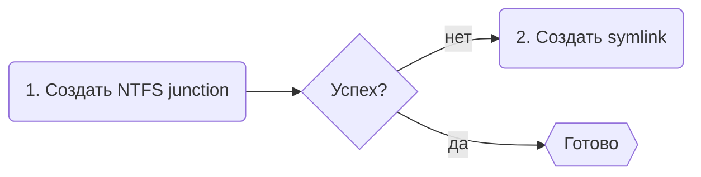

import SymlinkPermissionExplainer from '../_components/SymlinkPermissionExplainer.mdx';

# Режимы работы

NVM for Windows работает в одном из двух режимов: link или shim. Эти режимы определяют, как выполняются Node.js, менеджеры зависимостей и глобальные модули. Режим работы можно переключить в любой момент.

```powershell title="Установка режима работы"
# Быстрый доступ
nvm use shim
nvm use link

# Также доступно в конфигурации nvm
nvm cfg set mode=shim
nvm cfg set mode=link
```

## Link Mode \{#link-mode}

В этом режиме используются ссылки для определения активной системной версии `node.exe`. Ссылка входит в `PATH`. При выполнении [`nvm use`](../command/use) меняется _цель_ пути ссылки, а не сам путь. `PATH` не меняется.

Режим link максимально приближен к запуску `node.exe` «как поставляется» с [nodejs.org](https://nodejs.org). Задержка нулевая, но продвинутые возможности современного рабочего процесса из режима Shim недоступны.

В версии 2.0.0 добавлена стратегия создания ссылок с «запасным» вариантом.



<SymlinkPermissionExplainer/>

:::warning
NVM for Windows v2 не пытается повысить права (то есть не показывает запрос UAC) при неудачном создании symlink. Если права блокируют создание ссылки, пользователь получает нативное уведомление на рабочем столе с подсказками.
:::

## Shim Mode (default) \{#shim-mode-default}

Режим shim даёт новый, упрощённый опыт разработчика. По сравнению с Link Mode он избегает редких требований к правам, но добавляет небольшую задержку (~25–35 мс суммарно). Для большинства сценариев эта задержка незаметна. Поэтому режим Shim рекомендуется большинству пользователей.

Большинство пользователей не заметят влияния задержки shim, поэтому режим shim рекомендуется большинству.

Возможности режима shim:

- Автовыбор закреплённых версий через `.nvmrc`, `.node-version`, `package.json` или другие пользовательские файлы конфигурации runtime.
- Автоустановка отсутствующих версий при `nvm use`. (Опционально)
- Единая обработка несовпадений менеджеров пакетов.
- Ограничение прав Node.js/V8. (Опционально)
- Доверие издателю: проверка издателя node.exe, чтобы предотвратить подмену недоверенным node.exe.
- Нативное журналирование событий.
- Единые/настраиваемые периоды cooldown для всех основных менеджеров пакетов (npm/yarn/pnpm). _Требует дополнение Governance, доступно с сентября 2026._

:::info
В Windows действует «универсальный налог на задержку». Любой исполняемый файл запускается через [`CreateProcessW`](https://learn.microsoft.com/en-us/windows/win32/api/processthreadsapi/nf-processthreadsapi-createprocessw). Налог платится при запуске shim и снова, когда shim запускает `node.exe`. В среднем `CreateProcessW` занимает 15 мс. Shim добавляет 1–3 мс на определение нужной версии Node.js и безопасную передачу команды.

`15ms (shim CreateProcessW) + 3ms (логика shim) + 15ms (node.exe CreateProcessW) = 33ms`
:::

## Сравнение

||Link|Shim|
|:-|:-:|:-:|
|Задержка[^1]|0ms|25–35ms|
|Системная версия|:heavy_check_mark:|:heavy_check_mark:|
|Автоматическая установка|:heavy_check_mark:|:heavy_check_mark:|
|Автоопределение версии|:x:|:heavy_check_mark:|
|Особые права<br/><br/>|[`SeCreateSymbolicLinkPrivilege`](https://learn.microsoft.com/en-us/previous-versions/windows/it-pro/windows-10/security/threat-protection/security-policy-settings/create-symbolic-links)<br/>_для symlink на [UNC path](https://learn.microsoft.com/en-us/dotnet/standard/io/file-path-formats#unc-paths)_|Нет<br/><br/>|


[^1]: Задержка в основном из «универсального налога» Windows `CreateProcessW`. Сам исполняемый файл shim добавляет ~1 мс.
