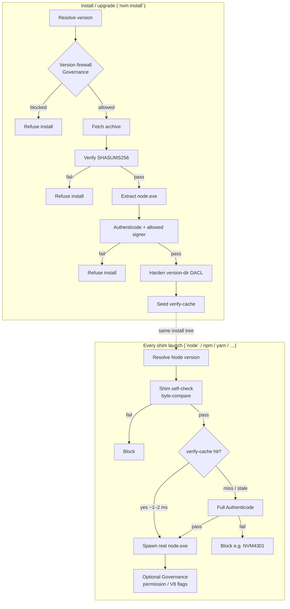
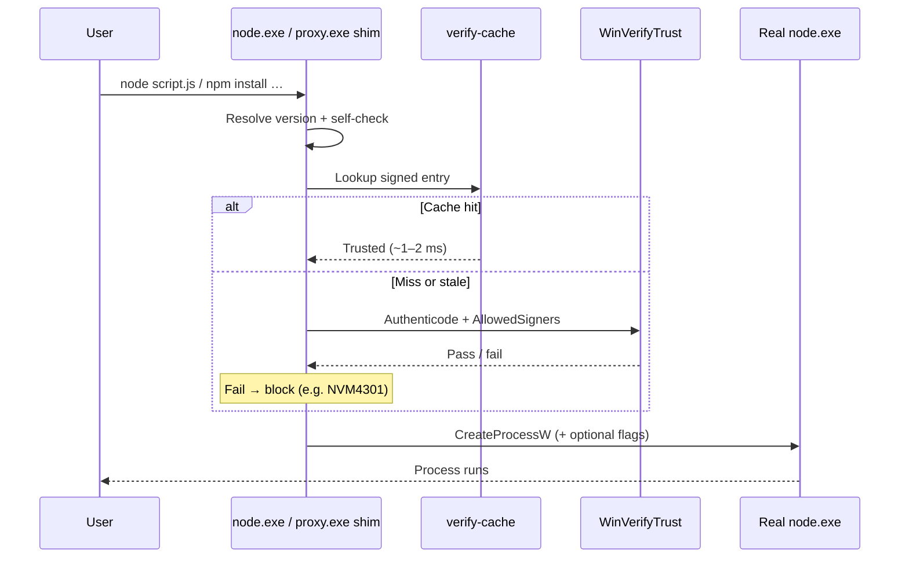

# Понимание безопасности

NVM for Windows v2 считает Node.js недоверенной загрузкой, пока не пройдут проверки целостности, затем в режиме **shim** снова проверяет бинарник при каждом запуске. Certified и Governance-редакции добавляют машинные политики, version firewall и (опционально) зеркало загрузок Author.

На этой странице — **что проверяется**, **когда** и **какая редакция** владеет контролем. Подробности — в связанных документах.

## Модель безопасности кратко \{#security-model-at-a-glance}

**Ключи по редакциям**

| Контроль | Community | Certified | Governance add-on |
|:-|:-:|:-:|:-:|
| Archive SHASUM + Authenticode `node.exe` | ✓ | ✓ | ✓ |
| Allowed publisher org / thumbprint pins | ✓ | ✓ | ✓ |
| Ужесточение DACL каталога версии | ✓ | ✓ | ✓ |
| Shim verify-cache + доверие на каждый запуск | shim mode | shim mode | shim mode |
| Переопределение политикой HKLM (ADMX) | — | ✓ | ✓ (+ полный ADMX-пакет) |
| Version allow/block firewall | — | — | ✓ |
| Cooldown пакетных менеджеров | — | — | ✓ |
| Принудительный `--permission` / V8 lockdown | — | — | ✓ |
| Author mirror + hosted rules | — | — | ✓ |

Функции безопасности shim-режима не работают в [link mode](../features/modes#link-mode). Для управляемых парков предпочтителен shim.

## 1. Проверки при установке \{#install-time-verification}

Когда `nvm install` (или auto-install) получает сборку Node.js:

1. **Version firewall** (Governance) — `VersionAllowList` / `VersionBlockList` могут отказать версии до загрузки. См. [Version Firewall + Author Mirror](../features/author-mirror).
1. **Целостность архива** — `.7z` (или staged-архив) сверяется с опубликованным `SHASUMS256` для версии/архитектуры.
1. **Authenticode для `node.exe`** — после распаковки выполняется проверка доверия Windows. Одной валидной подписи мало: организация подписанта должна быть в allow list.
1. **Доверенные организации по умолчанию** — всегда доверяются `OpenJS Foundation`, `Node.js Foundation` и `Author Software Inc.`. Других (например **NodeSource**) добавляйте через [`AllowedSigners`](../cfg/registry#available-registry-keys). Опционально [`AllowedThumbprints`](../cfg/registry#available-registry-keys) закрепляют конкретные leaf-сертификаты.
1. **Ужесточение DACL** — каталог установки версии блокируется так, чтобы **другие учётные записи** не могли переписать `node.exe` (или подменить троян в этом дереве). Скомпрометированная учётная запись, уже владеющая профилем, всё ещё может атаковать свои файлы; контроль нацелен на cross-account и удалённую запись.
1. **Seed verify-cache** — пишется подписанная запись кэша, чтобы последующие запуски shim обходили полный Authenticode на горячем пути.

Поведение revocation настраивается (`AuthenticodeRevocation`; air-gapped установки предпочитают cached-проверки). См. [справочник политик реестра](../cfg/registry).

## 2. Проверки во время выполнения (shims) \{#runtime-verification-shims}

Основные runtime-shim v2:

| Бинарник | Роль |
|:-|:-|
| `.shim\node.exe` | Разрешает версию, проверяет доверие, применяет опциональные security-флаги, запускает настоящий Node |
| `utils\proxy.exe` | Тот же путь доверия для npm / npx / yarn / pnpm и CLI [глобальных модулей](../command/global-module-shims) |

(`reshim.exe` — вспомогательный, не повседневный command shim.)

При каждом запуске shim:

1. Определяет, какую версию Node.js запускать ([разрешение версии](./version-resolution)).
1. **Self-check**, если вызван из data-root `.shim` — byte-compare с каноническим payload Program Files / установки (целостность самого shim, не второй круг Authenticode).
1. **Доверяет `node.exe`** — предпочитает hit verify-cache (~1–2 ms). При miss или инвалидации кэша — полный Authenticode по allowed signers. Отказ блокирует выполнение (например **NVM4301**).
1. Опционально добавляет Governance security-флаги (ниже), затем `CreateProcessW` настоящего Node.js.

Подробности: [node (shim)](../command/node), [Package Manager Shims](../command/package-manager-shims).

## 3. Пакетные менеджеры и модули \{#package-managers-and-modules}

Через `proxy.exe` NVM может применять **Governance**-контроли пакетных менеджеров, например [`NpmModuleMinimumAge`](../cfg/registry#governance-keys) (cooldown / минимальный возраст публикации для npm, pnpm и yarn).

NVM **сейчас не** применяет allow/deny list **пакетов** npm для вложенных зависимостей. Supply-chain риск внутри `node_modules` остаётся проблемой upstream-реестра; более долгосрочная работа Author Software Runtime закрывает это отдельно. Что NVM *действительно* ограничивает сегодня:

- **Версии Node.js** — локальный firewall + опциональные правила Author mirror ([author-mirror](../features/author-mirror))
- **Доверие к издателю** `node.exe` на каждый запуск
- **Cooldown** при установках пакетных менеджеров (Governance)

## 4. Permission model и V8 lockdown Node (Governance, shim) \{#node-permission-and-v8-lockdown-governance-shim-mode}

Большинство команд не передают флаги permission model Node. Политика Governance может принудительно включать их на каждый shim-запуск:

| Политика | Эффект |
|:-|:-|
| `EnforcePermissionModel` | Добавляет `--permission` (Node 23+) или `--experimental-permission` (20–22). Default-deny FS/network, пока процесс не передаст `--allow-*`. NVM не внедряет grants. |
| `FreezeV8GlobalObjects` | Добавляет `--frozen-intrinsics` |
| `DisableEvalAndStringExecution` | Добавляет `--disallow-code-generation-from-strings` (блокирует `eval` / `new Function`; не покрывает `node:vm`) |

См. [Operating Modes](../features/modes) и [ключи реестра](../cfg/registry#available-registry-keys).

## 5. Реестр и enterprise-политики \{#registry-and-enterprise-policy}

Настройки живут в реестре Windows. В общих чертах:

- **Пользовательские предпочтения (HKCU)** — то, что интерактивный пользователь может менять без прав администратора.
- **Машинные предпочтения / Policies (HKLM)** — то, что пишут администраторы и MDM/GPO. Certified-сборки учитывают **машинную политику**, чтобы админы перекрывали пользовательский выбор по security-sensitive ключам.

Пакет **Governance** поставляет шаблоны **ADMX/ADML** для Active Directory и конфигурации в стиле Entra/Intune. Разные GPO могут задавать разный уровень риска (например блокировать EOL Node для большинства, разрешить одну legacy-версию команде миграции). См. [Administrative Templates](../cfg/ad) и [справочник политик реестра](../cfg/registry).

## 6. Зеркало загрузок Author (Governance) \{#author-download-mirror-governance}

Организации могут запретить публичный `nodejs.org/dist` на сетевом периметре и allow-list `mirror.author.io`. Тогда NVM качает через policy-aware зеркало Author. Контроли сочетают:

- Списки клиента/GPO (`VersionAllowList` / `VersionBlockList`, включая lifecycle-алиасы вроде `EOL`)
- **Hosted rules** в [клиентском портале](https://portal.author.io) (IP, geo, domain/tenant, SID, license group)

Подробности: [Version Firewall + Author Mirror](../features/author-mirror). Domain/tenant ID: [Как найти AD Domain ID или Entra Tenant ID](./find-domain-tenant-id).

## 7. Аудит и нативные интеграции \{#auditing-and-native-integrations}

Критические события установки, конфигурации и безопасности пишутся в Windows Event Viewer на Community и Certified. Опциональный **Advanced Logging** (Certified add-on) рассчитан на структурированные коды для SIEM. Логирование каждого вызова доступно через [`LogExecutions`](../cfg/registry#available-registry-keys) в shim-режиме.

См. [Event Logging](../features/log). Более широкий контекст продукта (включая native integrations): [Why we rewrote NVM for Windows](https://medium.com/@goldglovecb/why-we-rewrote-nvm-for-windows-3b6fa5be3e7f) (внешний).

## Связанные материалы \{#related}

| Тема | Документ |
|:-|:-|
| Поведение shim | [node (shim)](../command/node) |
| Shim npm / yarn / pnpm | [Package Manager Shims](../command/package-manager-shims) |
| Shim vs link | [Operating Modes](../features/modes) |
| Ключи политик | [Справочник политик реестра](../cfg/registry) |
| Version firewall / mirror | [Author Mirror](../features/author-mirror) |
| Редакции | [Выбор edition](./builds/) |
| Коды ошибок (NVM43xx / NVM44xx) | [Коды ошибок](../troubleshooting/error-codes) |
